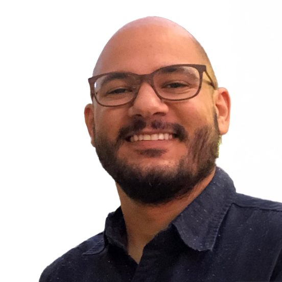
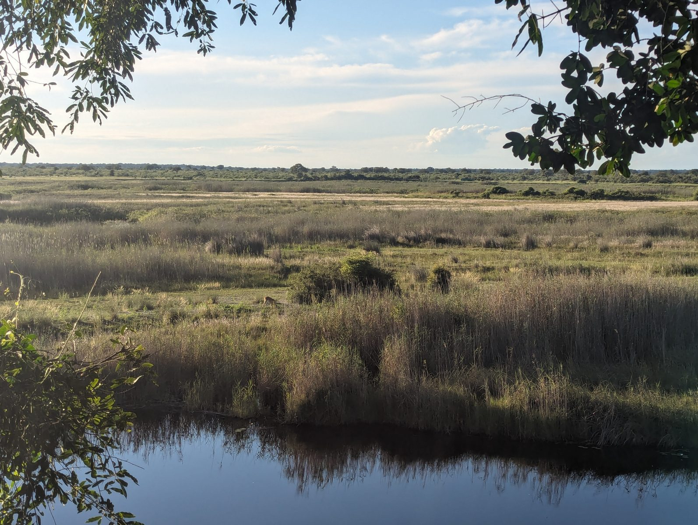
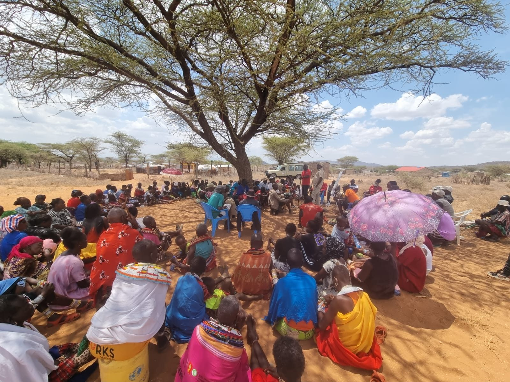

::: {.hero}
::: {.hero-copy}
Geography · Environmental governance · Southern Africa

# Community conservation, institutions, and participatory governance

I am a PhD candidate in Geography at the University of Florida. My research examines how communities, states, and conservation organizations govern land and wildlife, with a focus on community-based natural resource management, participatory governance, social capital, and institutional change in Southern Africa.

::: {.button-row}
[Research](research.qmd){.btn-site .btn-primary-site}
[Teaching](teaching.qmd){.btn-site .btn-secondary-site}
[Download CV](assets/pdf/King_Aaron_CV.pdf){.btn-site .btn-secondary-site}
:::

::: {.hero-portrait}
{.headshot fig-alt="Aaron R. King"}

::: {.site-note}
PhD Candidate, Department of Geography, University of Florida  
Graduate Certificate in Digital Geography and GIS
:::
:::
:::

::: {.hero-media}
{fig-alt="Wetland landscape in Southern Africa"}
:::
:::

::: {.card-grid}
::: {.site-card}
Research

### Institutions and devolution

I study CBNRM as an institutional development process, asking how incomplete devolution of authority and proprietorship rights shapes conservation, livelihoods, and political empowerment.
:::

::: {.site-card}
Methods

### Surveys, GIS, and fieldwork

My work combines household surveys, institutional audits, interviews, participatory methods, GIS, spatial statistics, and community-facing data interpretation.
:::

::: {.site-card}
Teaching

### Human-environment geography

I teach courses in economic geography, social geography, population geography, environmental governance, GIS, and mixed methods for human-environment research.
:::
:::

## Current work

My dissertation, *Institutions, Authority, and Governance: Understanding the Performance of Community-Based Natural Resource Management in Southern Africa*, investigates why CBNRM has produced conservation gains while more unevenly delivering on rural development, livelihoods transformation, and political empowerment. The project combines comparative institutional analysis with original household survey data from six communal conservancies in Namibia.

## Practice and partnerships

My research is closely tied to collaborative field programs with community members, CBNRM managers, students, NGOs, and conservation practitioners. Through Life Through Wildlife, SNAPP, and the GEF Fonseca Leadership Program, I help develop governance training, household monitoring tools, and community feedback processes designed to support adaptive management and more inclusive local decision-making.

{.feature-image fig-alt="Community meeting under a tree in Namibia"}
