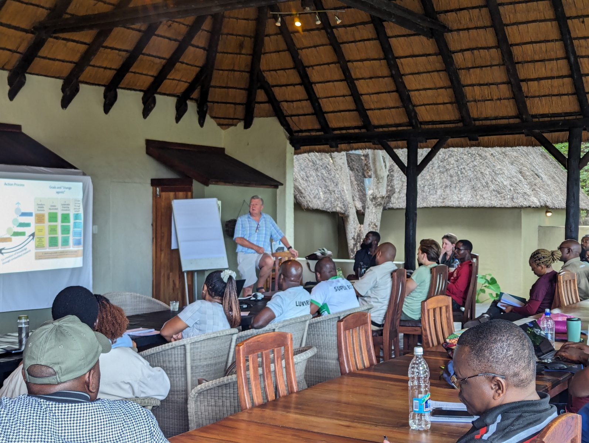
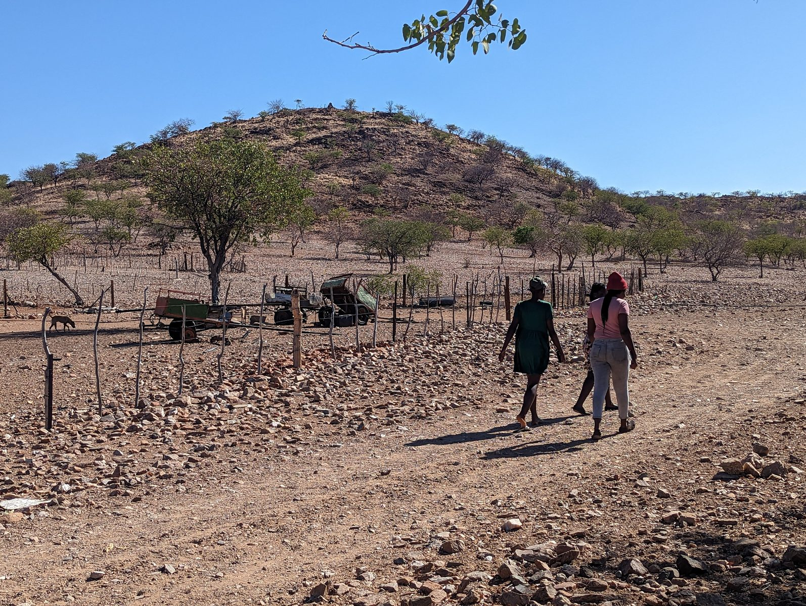
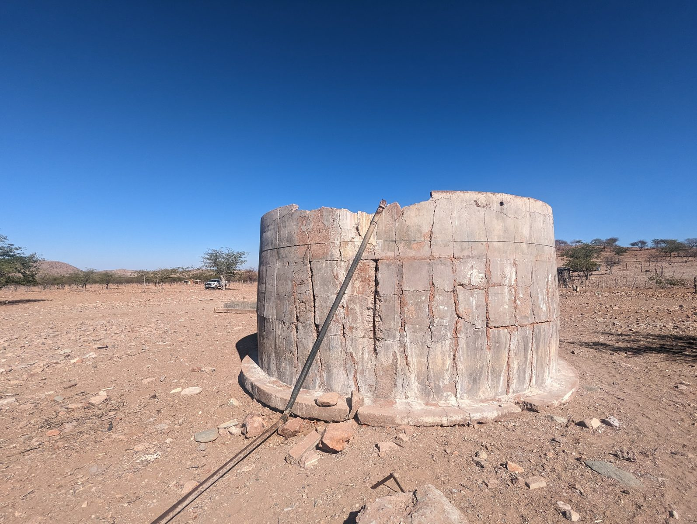
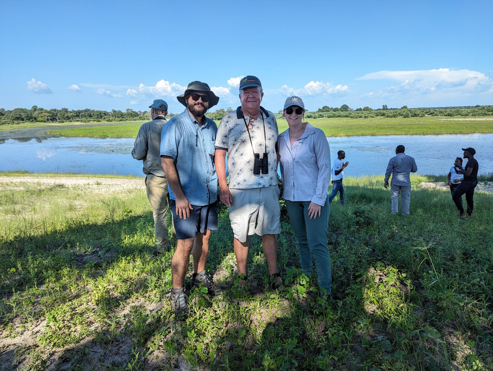

My research is embedded in collaborative work with community members, CBNRM managers, NGOs, students, and conservation practitioners. This practical work is not separate from my scholarship: it is where many of my research questions emerge, where findings are interpreted, and where institutional reforms can be tested.

## Life Through Wildlife

I work with Life Through Wildlife, a research and training initiative focused on community conservation, wildlife economies, and CBNRM governance in Southern and East Africa. The program supports professional training, field courses, and applied governance tools for community conservation practitioners.

## Governance Dashboard

The Governance Dashboard is a field-based monitoring and learning tool for community conservation organizations. It uses household surveys and community feedback processes to assess participation, rights, rules, trust, benefits, fairness, and perceptions of wildlife. The aim is to make governance data useful to communities, not only to researchers.

## Workshops and field training

Selected recent workshops and trainings include:

- **CBNRM Governance Manuals Development Workshop**, Stellenbosch, South Africa, 2025.
- **Life Through Wildlife Anchor Site and Governance Dashboard Survey Workshop**, Cape Town, South Africa, 2025.
- **CBNRM Governance Dashboard and Wildlife Economics Training**, Zambezi, Namibia, 2024.

::: {.gallery-grid}

:::

::: {.site-note}
Before publishing, confirm that any identifiable people in field photographs have consented to public web use.
:::
