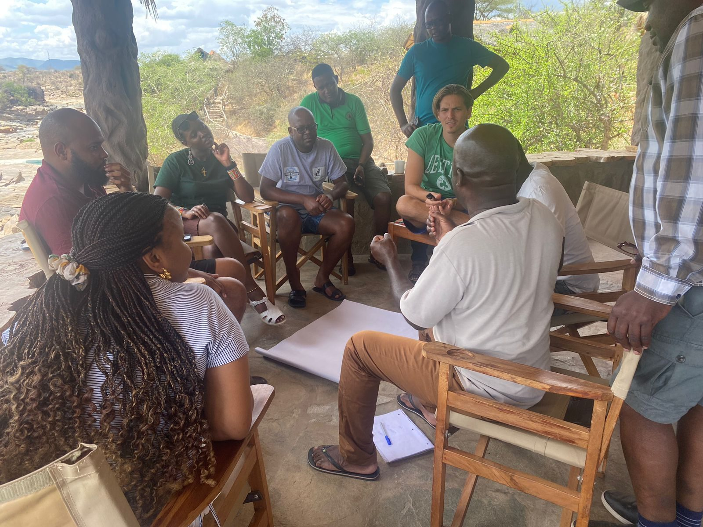

My research is located at the intersection of human-environment geography, political ecology, social-ecological systems, and New Institutional Economics. I study how communities govern land and wildlife, how participatory institutions shape collective action, and how incomplete devolution affects the social and political outcomes of conservation.

::: {.callout-box}
**Central question:** Under what institutional conditions can community-based conservation become not only a conservation strategy, but also a vehicle for local authority, accountability, and political empowerment?
:::

## Research themes

::: {.card-grid}
::: {.site-card}
Theme 1

### Aborted devolution and institutional change

I examine CBNRM as a process of institutional development rather than simply a conservation intervention. My work asks how partial transfers of authority, incomplete rights bundles, bureaucratic path dependence, and political workarounds shape long-run governance outcomes.
:::

::: {.site-card}
Theme 2

### Participation, trust, and social capital

Using household-level survey data, I analyze who participates in conservancy governance, why they participate, and how trust, associational membership, procedural fairness, and perceived influence shape inclusive decision-making.
:::

::: {.site-card}
Theme 3

### Spatial variation in governance

I use GIS, spatial statistics, and spatial econometrics to examine intra-community variation in governance access and participation, including how roads, conservancy offices, village histories, and local institutions structure inclusion.
:::
:::

## Dissertation research

My dissertation, *Institutions, Authority, and Governance: Understanding the Performance of Community-Based Natural Resource Management in Southern Africa*, asks why CBNRM has struggled to consistently deliver on its promises of rural development, livelihoods transformation, and political empowerment despite important conservation successes.

The project argues that many of these limitations are rooted in what Marshall Murphree called **aborted devolution**: the incomplete transfer of authority and proprietorship rights to communities. Empirically, the dissertation combines comparative institutional analysis across Southern Africa with household survey and spatial data from communal conservancies in Namibia.

[Read more about the dissertation](dissertation.qmd){.btn-site .btn-secondary-site}

## Methods

I use pluralistic methods suited to the institutional and geographic character of human-environment problems:

- household surveys and governance indices;
- interviews, focus groups, and participatory field methods;
- institutional audits and comparative-historical analysis;
- GIS, spatial statistics, and spatial econometrics;
- community-facing data interpretation and monitoring systems.

{.feature-image fig-alt="Small-group field discussion with conservation practitioners"}

## Future agenda

My next phase of research moves from diagnosing institutional failure to studying pathways for reform. This work will examine how participatory budgeting, village-level meetings, community game guard programs, and other governance reforms affect environmental, economic, social, and governance outcomes across community conservation sites in Southern and East Africa.
