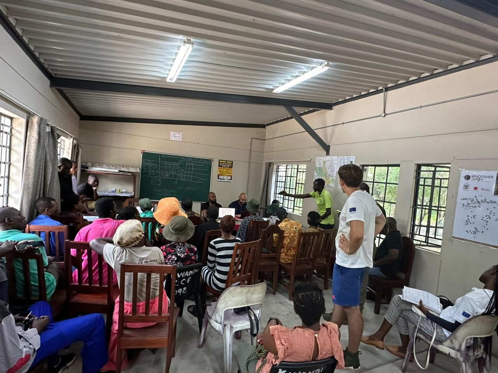

My teaching is grounded in active learning, scaffolded methods training, inclusive pedagogy, and sustained critical inquiry. I want students to connect concepts to real-world problems and problems to methods: to ask good questions, evaluate evidence, and see human-environment systems as shaped by institutions, power, place, and history.

::: {.callout-box}
**Teaching areas:** economic geography, environmental studies, environmental justice, political ecology, GIS, population geography, social geography, community-based conservation, mixed methods, and global environmental governance.
:::

## Teaching philosophy

I design courses around structured inquiry and practical skill development. In my geography courses, students work with real datasets, build maps and visualizations, and develop original research projects. Because many students are encountering spatial analysis or social science methods for the first time, I use scaffolded labs, formative feedback, and multiple pathways for demonstrating learning.

I also see mentorship as central to teaching. My approach emphasizes intellectual seriousness alongside accessibility: meeting students where they are, offering clear structure, and helping them build confidence as researchers, writers, and analysts.

## Courses taught

- **GEO 3502: Economic Geography** — instructor of record, classroom and online formats.
- **GEO 2410: Social Geography** — instructor of record, online format.
- **GEO 3430: Population Geography** — instructor of record and adjunct lecturer, classroom, online, and HyFlex formats.

## Courses prepared to teach

::: {.card-grid two}
::: {.site-card}
Environmental studies / geography

- Introduction to Environmental Studies
- Environmental Justice
- Political Ecology
- Community-Based Conservation
- Parks, People, and Protected Areas
- Global Environmental Governance
- Economic Geography
:::

::: {.site-card}
Methods

- GIS for Environmental and Social Analysis
- Spatial Data Analysis
- Mixed Methods in Human-Environment Research
- Survey and Interview Methods
- Community-Based Research Methods
- Data Visualization for Environmental Studies
:::
:::

## Field teaching and mentorship

I have helped train students, enumerators, and conservation practitioners in household survey design, sampling, KoboToolbox/ODK, participatory interpretation of data, and governance monitoring. These experiences inform my classroom teaching and allow students to see methods not as abstract technical procedures, but as tools for collaborative and accountable research.

{.feature-image fig-alt="Classroom training session with CBNRM practitioners"}
